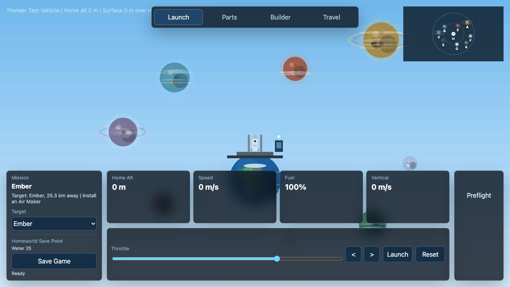
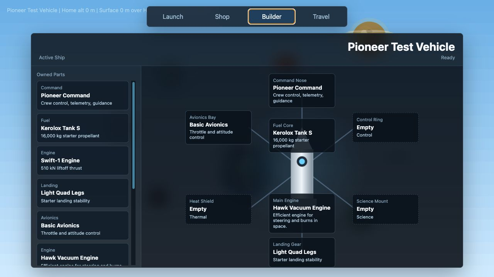
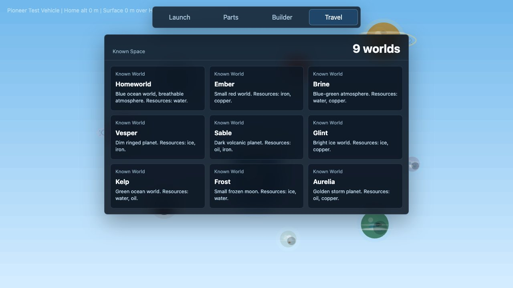

# Galaxy Exploration

[Play Galaxy Exploration](https://icequeen1024.github.io/galaxy-exploration/)

A 2D JavaScript space exploration game prototype built with Vite, PixiJS, and a custom launch physics simulation. The current build focuses on launching from Homeworld, steering through gravity and atmosphere, visiting nearby planets, saving progress, buying parts, and assembling a ship in the builder.

## Features

- Real-time PixiJS launch scene with telemetry, throttle, steering, and mission outcomes.
- Physics model for thrust, fuel burn, gravity, atmosphere, drag, orbit, escape, landing, and crashes.
- Discoverable planet map with mission targeting and Homeworld return flow.
- Local save data for money, resources, unlocked parts, built ships, mission history, and save points.
- Shop and builder screens for buying parts and equipping the active ship.
- Unit tests for simulation and save-data behavior, plus Playwright coverage for core UI flows.

## Screenshots

| Launch | Builder | Travel |
| --- | --- | --- |
|  |  |  |

## Requirements

- Node.js 20.19.0 or newer
- npm

## Getting Started

Install dependencies:

```sh
npm install
```

Start the development server:

```sh
npm run dev
```

Open the local URL printed by Vite, usually `http://127.0.0.1:5173/`.

## Controls

- Use the throttle slider to set engine power.
- Press **Launch** or the spacebar to lift off.
- Use the left and right arrow keys, or the on-screen steering buttons, to rotate the ship.
- Use **Reset** to return to the launch pad.
- Switch between Launch, Shop, Builder, and Travel from the top navigation.

## Scripts

```sh
npm run dev       # Start the Vite dev server
npm run build     # Build the app for production
npm run preview   # Preview the production build
npm run lint      # Run ESLint
npm run test      # Run Vitest unit tests
npm run test:e2e  # Run Playwright end-to-end tests
```

## Deployment

GitHub Pages is deployed by `.github/workflows/deploy-pages.yml`. In the repository Pages settings, use **GitHub Actions** as the build and deployment source so Pages publishes the Vite `dist` build instead of the raw source files.

## Project Layout

```text
src/main.js                       App shell, Pixi rendering, UI state, missions, shop, and builder
src/simulation/launchPhysics.js   Launch physics and gravity helpers
src/data/saveData.js              Save-data schema, normalization, and localStorage persistence
src/styles.css                    Game UI and screen styling
tests/                            Vitest unit tests
e2e/                              Playwright browser tests
public/assets/                    Static game assets
```

## Development Notes

Save data is stored in `localStorage` under `galaxy-exploration.save.v1`. Clear that key in the browser if you need to reset progression while testing.
